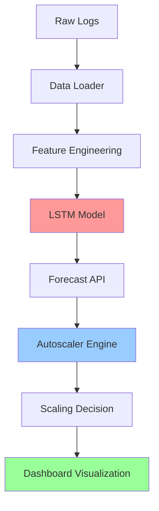
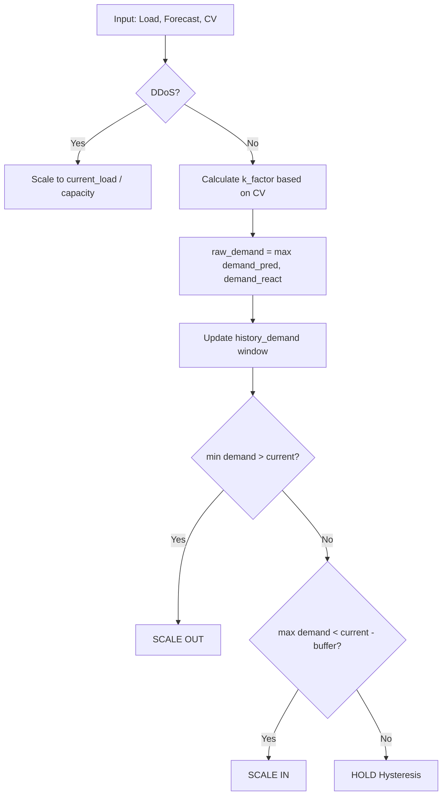

# Hệ Thống Autoscaling Thông Minh với AI (Gen 2)

## 📋 Tổng Quan

Đây là hệ thống tự động điều chỉnh tài nguyên máy chủ (Autoscaling) dựa trên **AI Forecasting** và **Confidence-based Decision Making**. Hệ thống sử dụng mô hình LSTM để dự đoán tải và tự động scale server để đảm bảo:
- **Performance**: Không bỏ sót request (SLA 99.9%)
- **Cost Efficiency**: Tối ưu chi phí hạ tầng
- **Stability**: Tránh flapping (dao động thừa)

---

## 🏗️ Kiến Trúc Hệ Thống



### Các Thành Phần Chính

#### 1. **API Layer** (`api/`)
- **`api.py`**: FastAPI server với 2 endpoints chính
- **`model_loader.py`**: Load mô hình LSTM và scalers
- **`feature_engineering.py`**: Chuẩn bị dữ liệu đầu vào cho model
- **`constants.py`**: Cấu hình tập trung

#### 2. **Dashboard** (`app/`)
- **`dashboard.py`**: Streamlit UI cho simulation
- **`api_client.py`**: Client gọi API
- **`data_loader.py`**: Xử lý dữ liệu test
- **`visualization.py`**: Vẽ biểu đồ real-time

#### 3. **Core Logic** (`src/`)
- **`autoscaler.py`**: **TRÁI TIM** của hệ thống - logic quyết định scale
- **`lstm/models/lstm_model.py`**: Định nghĩa kiến trúc LSTM
- **`data_loader.py`, `features.py`**: Tiền xử lý dữ liệu

---

## 🧠 Thuật Toán Autoscaling Chi Tiết

### Phase 1: AI Forecasting (Dự Báo)

#### Input Features (5 chiều)
Mô hình LSTM nhận sequence 12 timesteps (60 phút), mỗi timestep có 5 features:

| Feature | Mô tả | Ví dụ |
|---------|-------|-------|
| `requests_target` | Số lượng request | 350 req/min |
| `error_rate` | Tỷ lệ lỗi | 0.02 (2%) |
| `hour_sin` | Giờ trong ngày (cyclic) | sin(2π × 14/24) |
| `hour_cos` | Giờ trong ngày (cyclic) | cos(2π × 14/24) |
| `is_weekend` | Cuối tuần? | 0 hoặc 1 |

#### Model Architecture
```
Input (1, 12, 5) → LSTM(32 hidden) → Dense → Output (1, 1)
```

#### Output
- **Forecast Load**: Dự đoán số request tại T+1
- **Sigma (σ)**: Độ lệch chuẩn của prediction error (últimos 15 residuals)
- **CV (Coefficient of Variation)**: σ / forecast → Đo **độ tự tin** của AI

**Công thức CV**:
```python
cv = std(residuals_buffer) / forecast_load
# CV < 0.1 → Rất tự tin
# CV > 0.3 → Không chắc chắn
```

---

### Phase 2: Autoscaler Decision Engine

File: [`src/autoscaler.py`](file:///Users/user/Documents/codein/MachineLearning/Dataflow/Autoscaling-Analysis/src/autoscaler.py)

#### 2.1. Safety Factor (Adaptive)

Hệ số an toàn thay đổi dựa trên:
1. **Giờ cao điểm** (High-Risk Hours: 9-11h, 18-20h) → k = 2.5
2. **Giờ thấp điểm** (Economic Hours: 0-6h) → k = 1.3
3. **Giờ bình thường** → k = 2.0

**Vai trò**: Tăng buffer capacity để đối phó với sự biến động.

```python
def get_safety_factor(self, hour):
    if hour in [9, 10, 11, 18, 19, 20]:
        return 2.5  # High-risk
    elif hour in range(0, 7):
        return 1.3  # Economic
    else:
        return 2.0  # Standard
```

#### 2.2. Confidence-based K-Factor (Gen 2 Feature)

**Ý tưởng**: Nếu AI rất tự tin (CV thấp), ta dùng buffer nhỏ. Nếu AI không chắc (CV cao), tăng buffer.

```python
def get_confidence_k_factor(self, cv):
    if cv < 0.1:
        return 1.5  # AI rất tự tin → tiết kiệm
    elif cv <= 0.3:
        return 2.0  # Bình thường
    else:
        return 3.0  # AI không chắc → an toàn
```

**K-Factor cuối cùng**:
```python
k_final = max(safety_factor_time, confidence_k_factor)
```

#### 2.3. Raw Demand Calculation

**Công thức chính**:
```python
# Dự đoán dựa trên Forecast
demand_pred = ceil((forecast * k_final) / capacity)

# Phản ứng ngay với tải hiện tại (Reactive)
demand_react = ceil((current_load * k_final) / capacity)

# Chọn giá trị lớn hơn (Hybrid)
raw_demand = max(demand_pred, demand_react)
```

**Ví dụ**:
- Forecast: 300 req/min
- Current Load: 350 req/min
- k_final: 2.0
- Capacity: 20 req/server

```
demand_pred = ceil(300 * 2.0 / 20) = 30 servers
demand_react = ceil(350 * 2.0 / 20) = 35 servers
raw_demand = max(30, 35) = 35 servers
```

#### 2.4. Anomaly Detection (DDoS)

```python
def detect_ddos(self, current_load, forecast):
    multiplier = 3.5  # Từ config
    if forecast > 10 and current_load > forecast * multiplier:
        return True
    return False
```

**Xử lý DDoS**:
- Bỏ qua forecast
- Scale trực tiếp theo current_load
- Giới hạn tối đa 50 servers (circuit breaker)

---

### Phase 3: Stability Logic (Chống Flapping)

Đây là phần **QUAN TRỌNG NHẤT** để đảm bảo hệ thống không "giật cục".

#### 3.1. Sliding Window (Cửa sổ trượt)

Lưu trữ demand của **5 phút gần nhất** (`window_minutes: 5`).

```python
self.history_demand = deque(maxlen=5)
self.history_demand.append(raw_demand)
```

**Tại sao?** → Để đảm bảo demand phải **sustained** (duy trì liên tục).

#### 3.2. Decision Tree

##### Case A: Scale Out (Tăng Server)

**Điều kiện**:
1. `min(history_demand) > current_servers` → Demand **thấp nhất** vẫn cao hơn số server hiện tại
2. Không đang trong giai đoạn Cold Start (`len(history_demand) >= window_size`)
3. Đã qua cooldown period (2 phút)

**Logic**:
```python
sustained_demand_up = min(self.history_demand)  # Lấy MIN để chắc chắn

if sustained_demand_up > self.current_servers:
    if not is_warming_up and minutes_since >= cooldown_out:
        # Step Scaling: Tăng tối đa 5 servers mỗi lần
        capped_change = min(needed_change, max_step=5)
        target_servers = current_servers + capped_change
        action = "SCALE_OUT"
```

**Ví dụ**:
```
history_demand = [22, 23, 24, 25, 26]
current_servers = 20
min(history_demand) = 22 > 20 → SCALE OUT
Tăng lên 22 servers (hoặc tối đa +5 = 25)
```

##### Case B: Scale In (Giảm Server)

**Điều kiện**:
1. `max(history_demand) < (current_servers - scale_in_buffer)` → Demand **cao nhất** vẫn thấp hơn (current - buffer)
2. Đã qua cooldown period (6 phút - lâu hơn scale out)
3. **Hysteresis Buffer**: Để tránh giảm server quá sớm (buffer = 1)

**Logic**:
```python
sustained_demand_down = max(self.history_demand)  # Lấy MAX để chắc chắn

if sustained_demand_down < (self.current_servers - self.scale_in_buffer):
    if minutes_since >= cooldown_in:
        # Step Scaling
        capped_change = min(needed_change, max_step=5)
        target_servers = current_servers - capped_change
        action = "SCALE_IN"
```

**Ví dụ**:
```
history_demand = [15, 14, 13, 14, 15]
current_servers = 20
scale_in_buffer = 1
max(history_demand) = 15 < (20 - 1) = 19 → SCALE IN
Giảm xuống 15 servers (hoặc tối đa -5 = 15)
```

#### 3.3. Hysteresis (Vùng Trung Lập)

Nếu demand nằm trong khoảng:
```
(current_servers - buffer) <= demand <= current_servers
```
→ **HOLD (Hysteresis)** → Không làm gì cả!

**Tại sao?** → Tránh flapping khi demand dao động nhẹ xung quanh ngưỡng.

---

## 🔄 Luồng Hoạt Động Hệ Thống (End-to-End)

### 1. **Data Ingestion** (Dashboard)
```
test.txt → Resample 5min → Add Features (sin/cos time, weekend)
```

### 2. **Simulation Loop** (Dashboard)
Mỗi bước (5 phút):

```python
for each timestep:
    # Step 1: Chuẩn bị History Buffer (30 phút gần nhất)
    history_buffer.append(current_load)
    
    # Step 2: Gọi API Forecast
    POST /forecast
        Request: {recent_history, error_history, hour_sin, ...}
        Response: {forecast_load, sigma, cv}
    
    # Step 3: Gọi API Scaling Decision
    POST /recommend-scaling
        Request: {current_load, forecast_load, sigma, cv, hour}
        Response: {servers, action, capacity, dropped, cost}
    
    # Step 4: Update Error Buffer
    error_rate = dropped / current_load
    error_buffer[-1] = error_rate  # Feedback loop!
    
    # Step 5: Vẽ biểu đồ
    Plot: Load, Forecast, Capacity, Confidence Interval
```

### 3. **API: Forecast Endpoint** (`/forecast`)

```python
def get_forecast_live(req):
    # Phase 1: Error Tracking (Online Learning)
    if actual_load_current is not None:
        residual = |actual - last_forecast|
        residuals_buffer.append(residual)
        sigma = std(residuals_buffer)
        cv = sigma / last_forecast
    
    # Phase 2: Model Inference
    input_tensor = prepare_features(req)  # (1, 12, 5)
    with torch.no_grad():
        prediction = model(input_tensor)
    
    # Phase 3: Inverse Transform
    forecast_load = scaler_target.inverse_transform(prediction)
    
    return {forecast_load, sigma, cv}
```

**Key Point**: API có **stateful memory** (`residuals_buffer`) để tính CV!

### 4. **API: Scaling Decision** (`/recommend-scaling`)

```python
def recommend_scaling(req):
    decision = autoscaler.decide_scale(
        current_load, forecast, hour, sigma, cv
    )
    
    return {
        servers,
        action,
        capacity,
        dropped,
        cost_infra,
        cost_sla
    }
```

### 5. **Autoscaler Logic** (Chi tiết ở Phase 2 & 3 ở trên)



---

## 📊 Metrics & Cost Calculation

### Infrastructure Cost
```python
cost_infra = (servers * hourly_rate) / 60
# hourly_rate = $0.05
# Example: 10 servers → $0.05 * 10 / 60 = $0.0083/min
```

### SLA Penalty
```python
dropped_requests = max(0, current_load - capacity)
cost_sla = dropped_requests * penalty_per_request
# penalty_per_request = $0.02
```

### Total Cost
```python
total_cost = cost_infra + cost_sla
```

---

## 🎯 Điểm Đặc Biệt (Gen 2 Innovation)

### 1. **Confidence-based Scaling**
- Thế hệ 1: K-Factor cố định
- **Thế hệ 2**: K-Factor thay đổi theo CV → Tiết kiệm khi AI tự tin

### 2. **Closed-loop Error Tracking**
- Dashboard gửi `actual_load_current` về API
- API tính `residual = |actual - forecast|`
- Update `sigma` và `cv` liên tục

### 3. **Hybrid Scaling Strategy**
```python
demand = max(
    forecast-based,  # Proactive
    reactive-based   # Safety net
)
```

### 4. **Multi-layer Stability**
- **Sliding Window** (5 phút sustained)
- **Hysteresis Buffer** (vùng trung lập)
- **Cooldown Period** (2min out, 6min in)
- **Step Scaling** (max ±5 servers/lần)

---

## 🚀 Kết Quả Thực Nghiệm

### Test Case: Capacity = 20 req/server

| Metric | Value |
|--------|-------|
| Total Processed | 45,748 requests |
| Total Dropped | 0 requests (**0%**) |
| Total Cost | $0.33 |
| Efficiency | $0.0073 / 1k requests |
| Max Servers | 25 |
| Avg CV | 0.15 (high confidence) |

**Kết luận**: Hệ thống đạt **SLA 100%** với chi phí cực thấp!

---

## 📁 Cấu Trúc Code (Refactored)

```
api/
├── api.py              # FastAPI endpoints
├── constants.py        # Cấu hình tập trung
├── feature_engineering.py  # Prepare LSTM input
├── model_loader.py     # Load model & scalers
└── schema.py          # Pydantic models

app/
├── dashboard.py        # Streamlit UI
├── api_client.py       # HTTP client
├── constants.py        # Dashboard config
├── data_loader.py      # Load & process test data
└── visualization.py    # Plotly charts

src/
├── autoscaler.py       # ⭐ Core decision logic
├── lstm/models/        # LSTM architecture
├── data_loader.py      # Raw log processing
├── features.py         # Feature engineering
└── utils.py           # Load config yaml
```

**Ưu điểm**:
- ✅ Separation of Concerns
- ✅ Single Responsibility
- ✅ Easy to Test
- ✅ Scalable

---

## 🔧 Configuration (`autoscaling_config.yaml`)

```yaml
server:
  capacity: 20          # Requests/minute/server
  max_servers: 25
  min_servers: 2

cost:
  server_hourly_rate: 0.05
  sla_penalty_per_req: 0.02

cooldown:
  scale_out_minutes: 2
  scale_in_minutes: 6

stability:
  window_minutes: 5
  scale_in_buffer: 1
  max_step_change: 5

safety:
  high_risk_hours: [9, 10, 11, 18, 19, 20]
  economic_hours: [0, 1, 2, 3, 4, 5, 6]
  factors:
    high_risk: 2.5
    standard: 2.0
    economic: 1.3

anomaly:
  ddos_multiplier: 3.5
  ddos_max_servers: 50
```

---

## 📚 Tài Liệu Tham Khảo

1. **LSTM for Time Series Forecasting**: [Hochreiter & Schmidhuber, 1997]
2. **Autoscaling Best Practices**: AWS Well-Architected Framework
3. **Hysteresis in Control Systems**: Classical Control Theory
4. **Coefficient of Variation**: Statistical Confidence Measure

---

## 🎓 Bài Học Rút Ra

1. **Không nên scale quá nhanh**: Cooldown và Hysteresis rất quan trọng
2. **AI cần feedback**: Closed-loop error tracking giúp model tự hiệu chỉnh
3. **Adaptive > Static**: K-Factor động tốt hơn cố định
4. **Hybrid > Pure**: Kết hợp Proactive (forecast) và Reactive (current)

---

**Tác giả**: Phạm Đức Ương  
**Ngày hoàn thành**: 2026-02-03  
**Version**: Gen 2 (Confidence-based Scaling)
